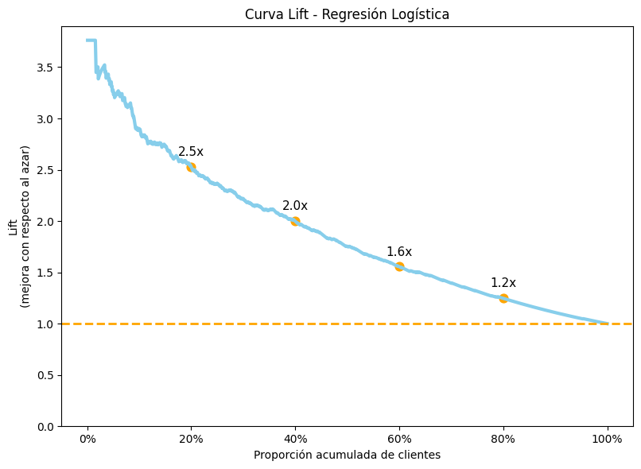
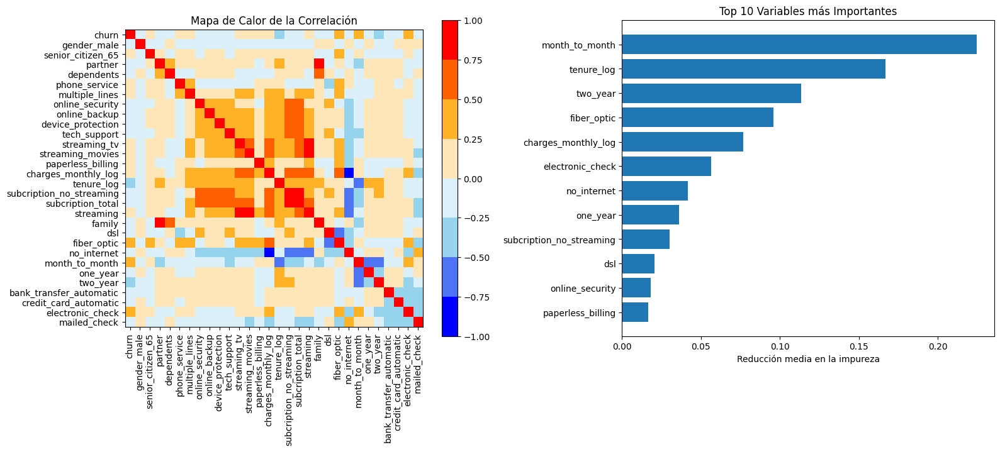
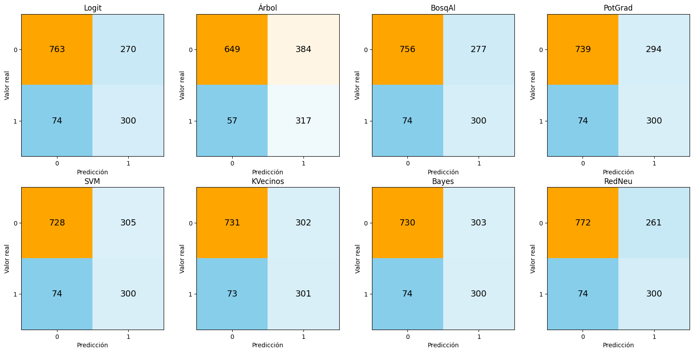

# Antes de que corten la línea: Modelado predictivo para la retención de clientes

## Resultado Principal

- El 20% de clientes con mayor riesgo concentra el 50% de las cancelaciones.
- 
- Aplicando un descuento del __% a estos clientes, las ganancias podrían incrementar en un __% (asumiendo un margen del 50%).

## Introducción

La evasión de clientes, también conocida como churn, ocurre cuando un cliente decide cancelar un servicio o dejar de utilizar un producto. Este fenómeno representa un desafío estratégico para las empresas, ya que impacta directamente en la rentabilidad y el crecimiento sostenido.

En este proyecto se analizan 7.266 registros de clientes de Telecom X con el objetivo de identificar los principales factores asociados a la cancelación y desarrollar modelos predictivos capaces de estimar el riesgo de churn.

A partir de técnicas de análisis exploratorio, ingeniería de variables y modelado con múltiples algoritmos de machine learning, se construyen herramientas que permiten detectar clientes de alto riesgo y facilitar la implementación de estrategias de retención basadas en evidencia.

## Resumen

- La tasa de cancelación observada es del 27%.
- Se ajustaron 8 modelos predictivos con optimización de hiperparámetros.
- Bajo todas las métricas evaluadas, el mejor modelo fue la regresión logística regularizada.
- El modelo permite capturar el 80% de las cancelaciones concentrándolas en un grupo donde 1 de cada 2 clientes cancelará, duplicando el riesgo promedio.
- Esto permite construir un grupo de alto riesgo donde la probabilidad de cancelación es aproximadamente el doble que en la población general.

## Factores más importantes asociados al riesgo de cancelación:

- **Antigüedad del cliente**: Clientes más nuevos presentan mayor riesgo.
- **Gasto mensual**: Mayor gasto implica mayor riesgo.
- **Tipo de internet**: Fibra óptica tiene mayor riesgo que DSL y Sin internet
- **Tipo de contrato**: Mensual tiene mayor riesgo que Anual y este que Bianual

## Posibles acciones generales

- Enfocar promociones en los clientes más nuevos (0 a 6 meses), son los que mayor reducción de riesgo tienen.
- Enfocar promociones en los clientes de mayores gastos, reducir el costo de su plan implica retenerlo más tiempo.
- Analizar el caso de la fibra óptica y porque muestra cancelaciones más elevada. ¿La infraestructura funciona bien?
- Promocionar planes anuales o bianuales.

## Posibles acciones enfocadas

- Utilizar el modelo para focar recursos en el grupo de alto riesgo de cancelación (A), este representa una quinta parte de los clientes pero captura al 50% de las cancelaciones totales.
- Ignorar a los grupos de bajo riesgo (D y E), ellos representan el 40% de los clientes pero solo el 7% de las cancelaciones.
- De disponer más recursos se pueden atender al grupo B, acumulando el 80% de las cancelaciones.

## Lift

La siguiente gráfica presenta las ganancias respecto al azar del modelo. Concentrandonos en los grupos con mayor chance de cancelación identificamos hasta 2.5 veces mejor que seleccionando al azar.

| Grupo |   Cantidad de clientes | Riesgo de Cancelación | Porcentaje Acumulado de Cancelaciones |
|------|----------------------|-----------------------|----------------------------------------|
| A |  282 | 66% | 50% |
| B |  281 | 39% | 80% |
| C |  281 | 17% | 93% |
| D |  281 | 8% | 99% |
| E |  282 | 0% | 100% |

*Nota*: Resultados del modelo aplicado a la base de prueba, simulando su aplicación real.

## Advertencia

Este analisis asume que las variables fueron extraidas en el mismo momento del tiempo (mismo mes). Si en cambio pertenecen a un periodo del tiempo su interpretación cambiaría y requerirían un modelado diferente (analisis de supervivencia). Ejemplo: un cliente de 3 meses que canceló pasaría a ser tratado como un cliente de 1 mes que no canceló, luego de 2 meses que no canceló y finalemente como uno de 3 meses que si canceló, aportando mucha más información al modelo.

## Limpieza de la base

- En este trabajo se cuenta con 7,267 registros de clientes de Telecom X y su condición (cancela o no).
- Los datos se encuentran en formato JSON por lo que se los normaliza. La base de datos resultante cuenta con 23 variables.
- Se elimnaron 24 registros que no tenían información sobre la evasión.
- Se eliminaron 11 registros que no tenían información sobre la antigüedad (los datos aparentan ser clientes nuevos que aún no tuvieron ocasión de cancelar o no).
- Se crearon un total de 19 variables recurriendo a transformaciones, agrupaciones y one-hot encoding.
- Se analizarón una a una las variables, su distribución y su relación con la cancelación.
- Se eliminaron variables redundantes o sin información.

# Análisis exploratorio
## Correlación e Importancia

Se observan variables altamente correlacionadas entre sí. Si bien no afecta la capacidad predictiva del modelo, puede alterar la interpretación del modelo a la vez que no aportan información nueva además de retrasar los entrenamientos. Se eliminan las variables: Streaming, Familia , subscripciones totales y sin internet (cuya información ya está contenida en dsl - fibra óptica). 

Observamos que las variables más importantes para determinar la evasión son con diferencia el tipo de contrato (mes a mes, anual, bianual) y la antigüedad del cliente. Le siguen el tipo de internet (dsl, fibra óptica, sin internet) y los gastos mensuales.

*Nota técnica: se utilizó un modelo de bosque aleatorio para medir la importancia de las variables, este modelo tiene la ventaja de capturar relaciones no lineales y ser facil de entrenar. La importancia se mide como la reducción promedio de la impureza.*

## Variables numéricas
(COMBOPLOT HISTOGRAMA + LINEA -- DE LAS DOS VARIABLES NUMÉRICAS MÁS IMPORTANTES, LA LINEA ES EL PORCENTAJE DE CANCELACIÓN  )

## Variables Categóricas
(COMBOPLOT HISTOGRAMA + LINEA -- DE LAS DOS VARIABLES NUMÉRICAS MÁS IMPORTANTES, LA LINEA ES EL PORCENTAJE DE CANCELACIÓN  )

## Demás variables Categóricas
(GRÁFICO DE BARRAS -- EJE Y: NOMBRE DE LAS VARIABLES CATEGORICAS, EJE X:DIFERENCIA ABSOLUTA DEL PROCENTAJR DE CANCELACION))

## Separación, Validación cruzada, 
Se explica el riesgo de "memorizar" la base de datos.
Se explica que se separan las bases en Entrenamiento usada para ajustar modelos y Prueba utilizada para compararlos al final.
Durante el entrenamiento se separan los datos en 10 grupos, se utilizan 9 y se prueban en el decimo grupo. Este método permite usar estimaciones insesgadas durante el entrenamiento.
Gráfico que muestra un circulo (total de la base) del que salen dos flechas hacia dos circulos (Base de Entrenamiento, Base de Prueba). De la base de entrenamiento sale una flecha hacia 10 cuadrados. Uno de ellos marcado en rojo, se añade la nota: "entrenar en 9, probar en 1, rotar".

## Estandarización
Se estandarizan los datos para igualar la variabilidad ya que algunos modelos tienden a confundir variabilidad con importancia, por ejemplo un modelo puede pensar que el salario de un cliente que varía desde $0 a $1,000,000 es más importante que la edad que varía de 18 a 100 años, y esta que su sexo que varía entre 0 y 1 (0= hombre, 1 = mujer).

## Modelos de referencia

Se estiman dos modelos:
- Piso: Un árbol de decisión de un solo nivel, mucahs veces llamado "tronco de decisión". Este modelo extremadamente simple dicta la mínima capacidad predictiva que deberían alcanzar nuestros modelos más complejos.
- Techo: Un árbol de decisión más profundo, que a diferencia de los demás esta probado en el conjunto de entrenamiento. A diferencia de los demás modelos, este está "memorizando" las respuestas por lo que ningún modelo debería poder vencerlo.

## Ajuste de modelos
Se explica brevemente el AUC.
Se explica que los modelos trabajan con pesos para balancear los pesos.
Se explica brevemente cada uno de los 8 modelos y se nombran sus parámetros.

##  Selección de modelos
Se explica que los modelos están seteados para capturar el 80% de las cancelaciones, permitiendo una comparación justa.

Las matrices de confusión presentan tanto las veces que el modelo predijo bien como mal la clase, tanto para los clientes que cancelaron como los que no. 
Recordamos que preparamos los modelos para capturar el 80% de los clientes que cancelan, por lo que la línea inferior de la matrices son idénticas (70 mal clasificados, 300 capturados). Por lo que la diferencia radica en la línea superior de las matrices. Notamos que estas son practicamente idénticas, salvo el caso del árbol de decisión. Todas identifican correctamente a aproximadamente 750 clientes que no cancelaron. De todas ellas notamos que bosque aleatorio, regresión logística y redes neuronales son las que clasifican levemente mejor.

Otras medidas
Se describen brevemente la Precisión, la Sencibilidad, el F1, la Exactitud y el AUC. Se muestran gráficos de barras horizontales con todos los modelos y cada una de medidas, además de líneas punteadas marcando los modelos piso y techo.
Nuevamente son los mismos 3 modelos los que mejor performan, y lo hacen muy parecido al modelo techo.

## El modelo elegido

Se explica que se elige la Regresión Logística por estar en el top 3 de los que mejor se desempeñaron, además de tener la ventaja de ser altamente interpretable y computacionalmente poco costoso.

Se interpretan las variables más importantes.

(GRÁFICO DE BARRAS HORIZONTALES CON LOS COEFICIENTES)

## Mejoras Futuras