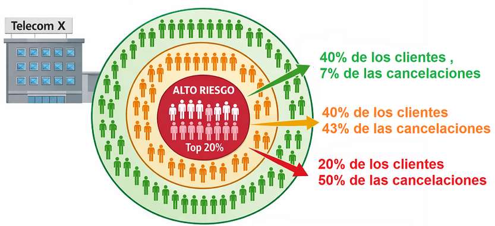
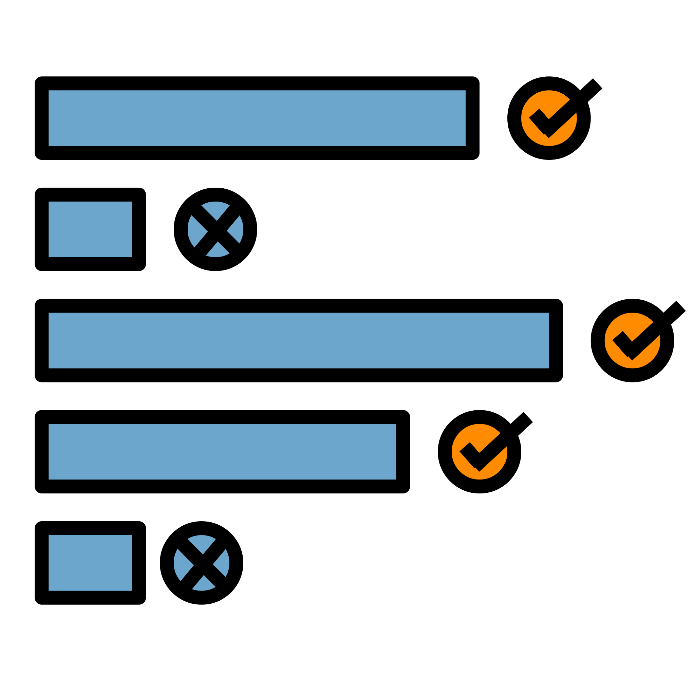
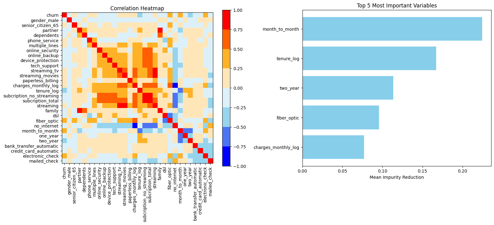
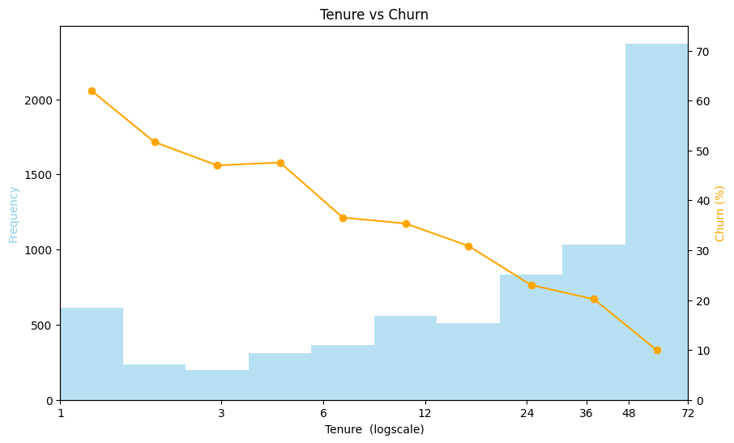
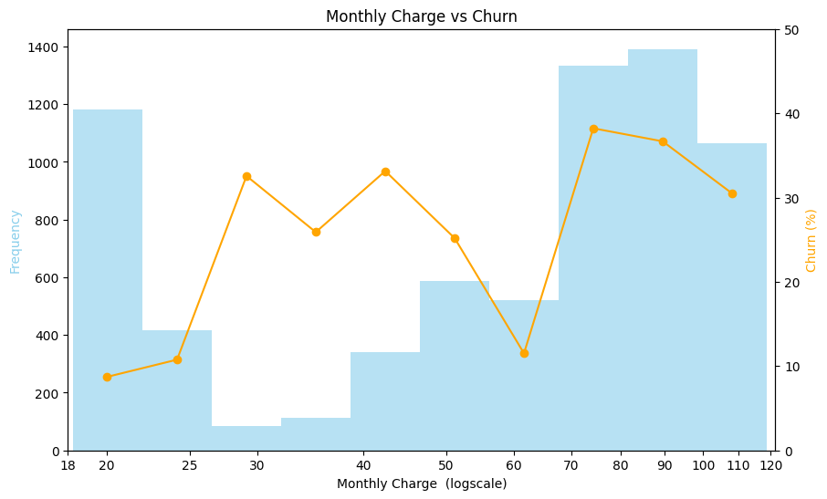
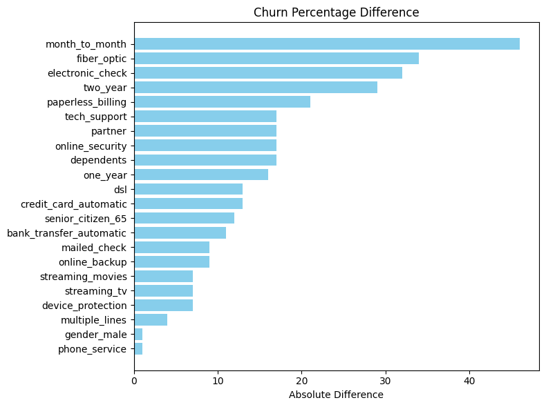
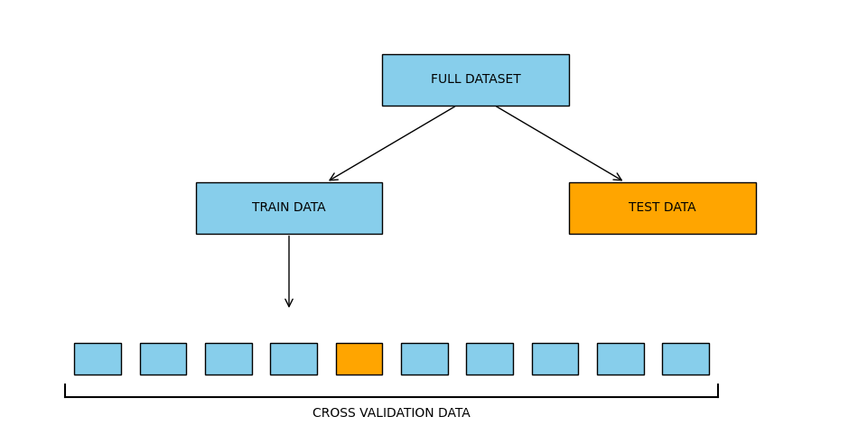
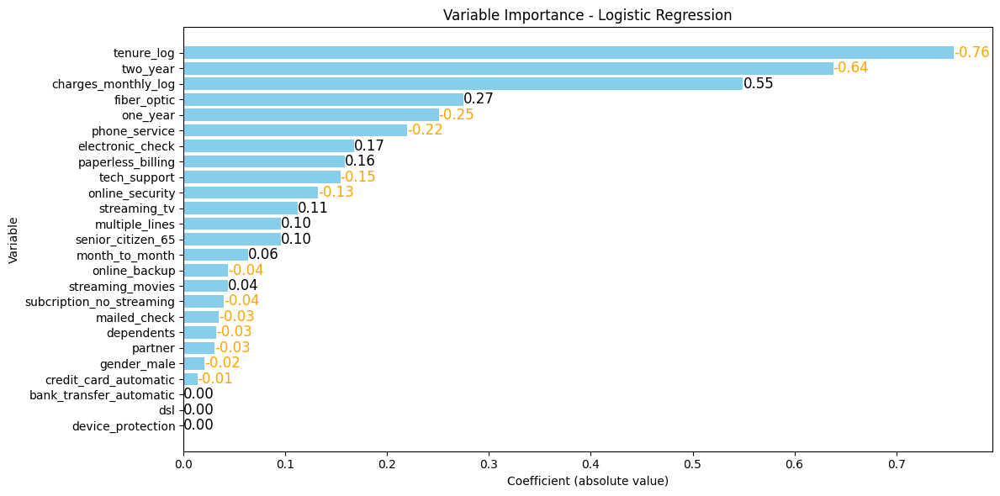

# Before they Cut the Line: Machine Learning Modeling to Churn Analysis

## Executive Summary

### Introduction

Customer churn represents a significant challenge for subscription-based businesses, as losing customers directly affects long-term revenue and growth. The objective of this project was to identify the main factors associated with customer cancellation and develop predictive models capable of estimating individual churn risk.

Using a dataset containing 7,266 Telecom X customers, an exploratory analysis was conducted, followed by feature engineering and the evaluation of multiple machine learning models with hyperparameter optimization. The selected model was a regularized logistic regression, which achieved predictive performance comparable to more complex models while maintaining a high level of interpretability.

### Key Findings

- The 20% of customers with the highest predicted churn risk accounted for approximately 50% of all cancellations.
- Expanding the intervention to the top 40% highest-risk customers captured approximately 80% of all future cancellations.
- Customers identified as low risk represented 40% of the customer base but only 7% of all cancellations, suggesting that retention efforts should not be prioritized for this segment.
- A targeted discount strategy was simulated, reducing the monthly charges of high-cost plans. Although the specific strategy tested did not improve long-term revenue, the analysis demonstrates how the predictive model can be used to evaluate potential retention campaigns before implementation.

### Main Factors Associated with Churn

The variables most strongly associated with a higher probability of cancellation were:

- **Customer tenure:** New customers, particularly those within their first six months, showed the highest churn risk.
- **Monthly charges:** Customers with more expensive plans exhibited a higher probability of cancellation.
- **Internet service type:** Fiber optic customers showed higher churn rates than DSL users or customers without internet service.
- **Contract type:** Month-to-month contracts showed substantially higher churn rates compared with one-year and two-year contracts.

### Recommended Actions

Based on these findings, the following strategies could be considered:

- Prioritize retention campaigns toward the highest-risk customer segments, where interventions have the greatest potential impact.
- Offer targeted incentives to new customers during their first months of service.
- Reevaluate pricing strategies and perceived value for customers with high monthly charges.
- Investigate the higher churn observed among fiber optic customers, which may indicate service quality issues or unmet customer expectations.
- Encourage migration from month-to-month contracts to longer-term agreements through targeted incentives or pricing benefits.

## Analytical Pipeline

The project followed a rigorous end-to-end workflow to ensure data quality, interpretability, and reliable churn risk stimation.

  

<b>Cleaning</b> Preparation of the raw data to a workable data set with 44 variables.

    

<b>Filtering & Scoping</b> 35 observation removed due to missing key information.

    

<b>Feature Engineer</b> Creation of 19 additional predictive variables.

  

<b>Graphical Analysis</b> Distribution analysis to identify transformations, patterns, and anomalies.

  

<b>Correlation Analysis</b> Reduction of redundancy while preserving interpretability.

  

<b>Modeling</b> Training of 8 machine learning models.

    

<b>Optimization</b> Cross-validation and hyperparameter tuning.

  

<b>Model Selection</b> Selection of the best model based on AUC performance and interpretability.

   

<b>Simulation</b> Business Simulation of retention strategies using model predictions.

  

## Dataset and Limitations

### Dataset Preparation

The analysis was conducted using a dataset containing 7,267 Telecom X customers and their churn status.

The original data was provided in JSON format and was normalized into a tabular structure containing 23 variables describing customer demographics, subscription characteristics, and billing information.

During the data cleaning process:

- 24 customers without information about their churn status were removed.
- 11 customers without tenure information were removed. These observations appeared to correspond to new customers who had not yet accumulated enough time to observe their churn behavior.
- Additional features were created through variable transformations, grouping categories, and one-hot encoding, resulting in 19 engineered variables.
- All variables were individually inspected to evaluate their distribution and relationship with customer churn.
- Redundant or non-informative variables were excluded from the final modeling dataset.

### Main Limitation: Unknown Temporal Structure of the Data

The original dataset does not specify whether customer information was collected as a single monthly snapshot or whether it represents observations accumulated over a period of time. The entire analysis presented in this report assumes the first interpretation: that each record corresponds to a customer observed at a single point in time.

Under this assumption, the models estimate the probability of a customer cancelling their service given their current characteristics. Therefore, the results should be interpreted as a cross-sectional assessment of churn risk.

If the data instead represented a longitudinal observation period, the appropriate interpretation and modeling approach would be different. For example, a customer who cancelled after three months of service would not only contribute a single record as a three-month customer who churned. The same customer would provide information as a one-month customer who remained active, a two-month customer who remained active, and finally as a three-month customer who churned.

In such a scenario, time-to-event methods, such as survival analysis, would be more suitable because they explicitly account for the duration until customer cancellation.

Consequently, the conclusions of this report are valid only under the assumption that the dataset represents a cross-sectional snapshot of the customer base.

## Exploratory Analysis

### Correlation and importance

The first step of the exploratory analysis was to study the relationships between variables. The correlation matrix (left) reveals several groups of strongly associated features, mainly related to internet services and additional subscriptions. Since these variables contain overlapping information, the redundant features were removed to simplify the final model without sacrificing predictive performance.

Next, the predictive relevance of the remaining variables was evaluated (right). Customer tenure and contract type emerged as the most relevant predictors of churn, followed by internet service type and monthly charges.

*Technical note:* A random forest model was used to estimate variable importance due to its robustness, ability to capture nonlinear relationships, and strong predictive performance. Importance was measured using the mean decrease in impurity, which represents the average contribution of each variable to improving the purity of the nodes where it is selected for splitting.

### Quantitative Variables

The graph above shows the distribution of clients across different tenure values (blue bars) together with their corresponding churn rates (orange line).

We observe that the churn rate decreases approximately linearly when tenure is represented on a logarithmic scale. This indicates that each time a client's tenure doubles, the expected reduction in churn risk is roughly constant. Consequently, the early stages of the customer relationship are especially critical: retaining a client from their first to second month has a similar impact on churn reduction as retaining a client from their first to second year.

*Note: It is also worth noting an unusual concentration of clients with a tenure of exactly 72 months. This pattern suggests a possible data censoring issue (e.g., a maximum recorded tenure) or the presence of a specific customer cohort that joined during a campaign six years prior to data collection. Additional information about the data generation process would be required to determine the underlying cause.*

TThe graph above shows the distribution of clients across different monthly charge values (blue bars) together with their corresponding churn rates (orange line).

No simple linear relationship is observed between monthly charges and churn rate. Instead we can divide it into four segments.

Clients with monthly charges between approximately $30 and $50, as well as those between $70 and $120, exhibit relatively high churn rates, with the latter group showing the highest risk. In contrast, clients paying between $18 and $25 and those paying around $60 display significantly lower churn rates. This pattern suggests that the dataset may contain different customer segments, plans, or service bundles with distinct pricing structures and satisfaction levels.

This finding is particularly interesting from a business perspective. In a hypothetical scenario, reducing the price of a $120 plan to approximately $60 would halve the monthly revenue per customer but could potentially reduce the churn rate from around 30% to 10%. Depending on customer lifetime value and the costs associated with service provision, such a strategy could lead to higher long-term profitability. However, further analysis would be necessary to determine whether the observed relationship is causal or simply reflects differences between customer segments.

### Qualitative Variables

The graph above represents the absolute difference in churn rate associated with each categorical variable. For example, the first variable, *Month-to-Month* contract, indicates that customers with this type of plan have a churn rate that differs by approximately 40 percentage points compared to customers with other contract types.

From the graph, we can identify several variables with a strong association with churn. The most influential factors include contract type (Month-to-Month, One-Year, and Two-Year contracts), payment method (particularly Electronic Checks), and internet service type (Fiber Optic and DSL).

These results suggest that customer characteristics and service choices play an important role in explaining churn behavior. However, it is important to note that these effects are analyzed independently; some variables may be correlated with each other, and a multivariate analysis would be necessary to determine their individual contribution to churn risk.

##  Model Development and Evaluation

### Preventing Overfitting: Train-Test Split and Cross-Validation

A major challenge in predictive modeling is overfitting, where a model memorizes the training data instead of learning general patterns that can be applied to new customers.

To obtain an unbiased estimate of model performance, the dataset was divided into a training set and an independent test set. The training set was used to develop the models, while the test set was reserved for the final comparison between algorithms.

During model development, 10-fold cross-validation was applied to the training set. The data was divided into ten groups; models were trained on nine groups and evaluated on the remaining one. This process was repeated ten times, rotating the validation group, allowing every observation to be used both for training and validation.

### Data Standardization

Numerical variables were standardized before fitting the models to ensure that all features were measured on a comparable scale.

Some machine learning algorithms are sensitive to the magnitude of the input variables and may assign disproportionate importance to features with larger numerical ranges. For example, a variable measured in dollars with values ranging from 0 to 1,000,000 could have a much larger influence on the model than a variable such as age ranging from 18 to 100, even if age carries more predictive information.

For numerical variables, standardization was performed by subtracting the mean and dividing by the standard deviation, resulting in variables with mean 0 and standard deviation 1.

For categorical variables encoded as binary indicators, only division by the standard deviation was applied. This approach preserves the interpretation of the reference category while placing the variables on a more comparable scale, simplifying the interpretation of the model coefficients.

### Reference Models: Establishing a Floor and a Ceiling

Before comparing complex algorithms, two reference models were built to establish a reasonable range of expected performance.

The **floor model** consisted of a single-level decision tree (decision stump). Due to its simplicity, it represents the minimum predictive ability that more sophisticated models should surpass.

The **ceiling model** consisted of a deep decision tree evaluated on the training set. This model intentionally overfits by memorizing the training data and therefore represents an approximate upper bound that realistic models should not exceed.

### Model Training 

Eight machine learning algorithms were trained and optimized through hyperparameter tuning. A short description of each model is presented:

| Model | Description | Hyperparameters Tested |
|---|---|---|
| Decision Tree | A sequence of simple decision rules that partition the data into increasingly homogeneous groups. The final tree complexity was selected using the 1-SE rule to balance performance and simplicity. | Complexity selected using the 1-SE rule |
| Random Forest | An ensemble of decision trees trained on random subsets of observations and features. Predictions are aggregated to reduce variance and overfitting. | `n_estimators`: 100, 250, 500, 1000 `max_features`: 4, 8, 12, 16 `max_depth`: 1, 2, 4, 8 |
| Histogram Gradient Boosting | Builds trees sequentially, where each new tree focuses on correcting the errors of previous trees. The histogram approach increases computational efficiency by binning numerical variables. | `max_depth`: 1, 2, 3 `learning_rate`: 0.01, 0.05, 0.10 `min_samples_leaf`: 100, 500, 1000 `l2_regularization`: 0, 0.01, 0.1 |
| Logistic Regression | A linear model for classification that estimates the probability of churn. Regularization prevents overfitting by penalizing large coefficients. | `C`: 0.001, 0.01, 0.1, 1, 10, 100 `penalty`: L1, L2 |
| Gaussian Naive Bayes | A probabilistic model that assumes predictors are conditionally independent given the class and follow Gaussian distributions. | Fixed model with Gaussian likelihood and equal class priors (0.5 / 0.5) |
| Support Vector Machine (SVM) | Finds the decision boundary that maximizes the margin between classes. The RBF kernel allows the model to learn non-linear boundaries. | `C`: 1, 10 `kernel`: RBF `gamma`: scale, 0.01, 0.1 |
| K-Nearest Neighbors (KNN) | Classifies a client according to the outcomes of the most similar clients in the training set, using a distance metric. | `n_neighbors`: 3, 5, 7, 11, 15, 25, 35, 55, 75, 101, 125, 151, 201 `weights`: uniform, distance `metric`: euclidean, manhattan |
| Neural Network | A multi-layer model where neurons combine inputs through weighted connections and non-linear activation functions, enabling the capture of complex relationships. | `hidden_layer_sizes`: (5), (10), (20), (40), (10,10), (20,20), (20,10), (10,10,10) `alpha`: 0.001, 0.01 `learning_rate_init`: 0.001, 0.01 `activation`: relu, tanh |

### Model Comparison
![alt text]!(image-11.png)

Model performance was primarily evaluated using the Area Under the Receiver Operating Characteristic Curve (AUC-ROC), which measures the model's ability to distinguish between customers who churn and those who remain active. Unlike accuracy, AUC-ROC is not dominated by the most frequent class and evaluates the model's ranking ability across all possible classification thresholds.

The figure also includes reference lines representing a floor and ceiling model. The floor model corresponds to a simple decision stump, providing a baseline level of performance. The ceiling model corresponds to an overfitted decision tree evaluated on the training data, representing an approximate upper bound of the predictive information available in the dataset, although it does not generalize to new customers.

The results show that all evaluated models achieved similar performance, with their AUC values between 0.82 and 0.85 and they approach the ceiling model (0.88). This suggests that there is no much more information available in the dataset to improve the models. 
Among the models tested, Neural Networks, Random Forest, and Logistic Regression achieved the highest performance. 

### Final Model Selection

Given that Logistic Regression provided comparable predictive accuracy while being substantially simpler and more interpretable, it was selected as the final model.

## Results

### Variable Importance

The graph above shows importance for each variable in the model. As we can see the tenure of the client is the single most important factor. Followed by the type of plan (Month-to-Month, One-Year, Two-Years) and the monthly charges.

*Note: in this logistic regression model, as all variables are standarized we can compare their relative importance by just looking at the absolute value of their coefficients.*

### Lift table

| Group |   Customers | Predicted Churn | Actual Churn | Cummulative captured churn |
|------|----|------------------|-----------------------|----------------------------------------|
| A |  282 | 65% | 66% | 50% |
| B |  281 | 38% | 39% | 80% |
| C |  281 | 19% | 17% | 93% |
| D |  281 | 7% | 8% | 99% |
| E |  282 | 2% | 0% | 100% |

The table above presents the performance of the selected model on the test dataset after sorting customers by their predicted churn probability and dividing them into five equally sized groups (quintiles).

First, we observe excellent calibration: the predicted churn probabilities are very close to the observed churn rates, with differences of no more than 2 percentage points in any group. This indicates that the model not only ranks customers correctly but also provides reliable estimates of their probability of churn.

Second, the model demonstrates strong discriminatory power. The observed churn rate decreases sharply across the risk groups, from 66% in the highest-risk quintile to almost 0% in the lowest-risk quintile. This means the model successfully concentrates the majority of potential churners in the top segments.

Finally, we can examine the cumulative captured churn, which represents the percentage of all churned customers contained within the highest-risk groups. By targeting only the first quintile (20% of customers), the company would identify approximately 50% of all customers who eventually churn. Expanding the intervention to the top two quintiles (40% of customers) would capture around 80% of all churn cases.

This result is particularly valuable from a business perspective because it allows retention strategies to be focused on the customers most likely to leave, reducing the cost of applying interventions to the entire customer base.

### Simulation

Although the model identified the clients with the highest probability of churn, the next question is which actions could be taken to improve retention. The following simulation was performed exclusively on the 20% of customers with the highest predicted churn risk.

Using the probabilities estimated by the selected model, two scenarios were simulated:

* **No intervention:** The customer data was left unchanged. Under this scenario, the group generated a total revenue of $69,000, with no customers remaining after 12 months.

* **Targeted discount:** Customers paying more than $60 per month were offered a discount reducing their monthly bill to $60. Customers paying between $25 and $60 were offered a discount reducing their bill to $25. The modified monthly charges were then introduced into the model to estimate the new churn probabilities. Under this scenario, the group generated a total revenue of $61,000, with two customers remaining after 12 months.

While this simulation should not be interpreted as a real estimate of the impact of a discount campaign, it illustrates how predictive models can be integrated into business decision-making. The analysis assumes that reducing the monthly charge causes the same reduction in churn observed in historical data, which may not hold in practice. For example, customer behavior may change when they know they are receiving a discount, and other factors affecting retention may not be captured in the dataset.

## Future Improvements

The greatest opportunities for improvement are related to the quality and quantity of the available data:

* **Additional variables:** The most significant improvement would likely come from collecting new information about customers. Variables related to customer behavior, service usage, customer support interactions, or characteristics of similar customer groups could provide valuable predictive information that is currently unavailable.

* **Longitudinal data and survival analysis:** A strong assumption made during the data cleaning and modeling process is that the dataset represents a single snapshot in time. If observations from multiple time periods were available, a survival analysis approach could be more appropriate, allowing the model to estimate not only whether a customer will churn, but also when the churn is likely to occur.

* **Increasing the sample size:** As more months pass and additional customers either churn or remain active, new observations can be incorporated into the dataset, reducing uncertainty and potentially improving model performance.

The current models already perform close to the estimated performance ceiling, suggesting that most of the information contained in the existing dataset is already being exploited. Nevertheless, several methodological improvements could still be explored:

* **Model ensembles:** Creating a meta-model that combines the predictions of several algorithms could provide small improvements in predictive accuracy.

* **Alternative model specifications:** Other parametric approaches, such as Probit or complementary log-log models, could be evaluated to determine whether different assumptions regarding the relationship between predictors and churn improve the results.

* **Additional feature engineering:** New interaction terms or explicit polynomial effects could be incorporated into the logistic regression model. Although splines did not improve the results, other non-linear representations may still provide additional predictive information.

* **Dimensionality reduction:** Techniques such as Principal Component Analysis (PCA) could be explored to reduce redundancy among highly correlated variables.

* **More rigorous feature selection:** Removing irrelevant variables or highly correlated predictors could improve model simplicity and potentially reduce overfitting.
