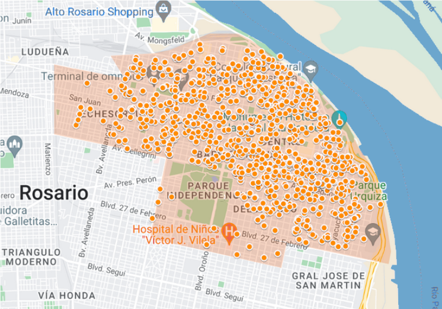
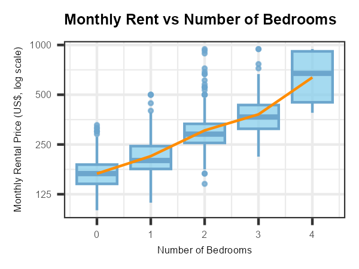
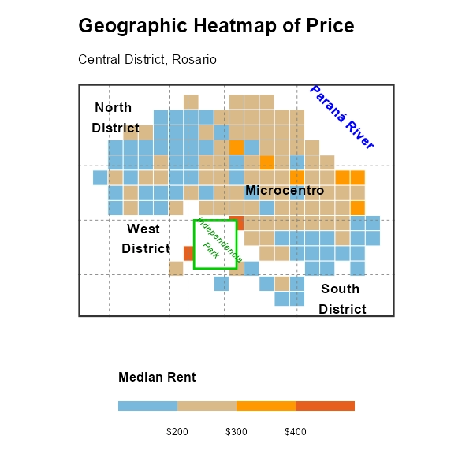
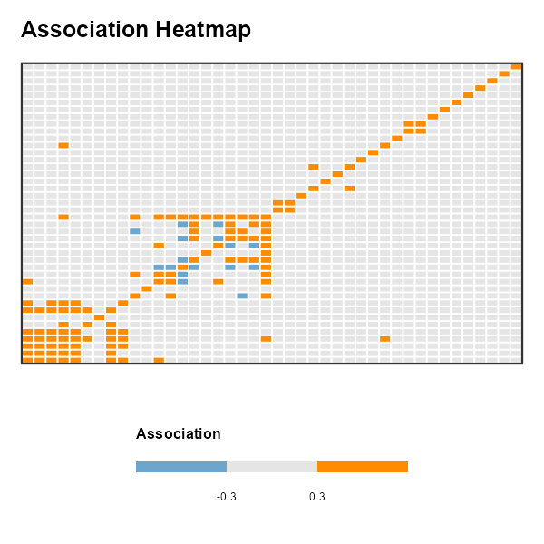
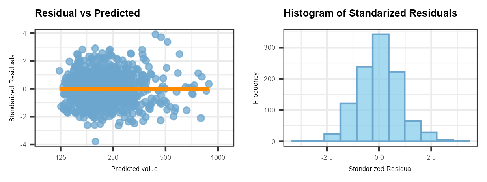

# The Secret Of Rental Values: A Quantitative Analysis Enhanced with Spatial And Textual Data

# Problem Statement

Rental pricing in urban housing markets often remains opaque, relying on fragmented information and subjective negotiation rather than systematic analysis. In Rosario, Argentina—one of the country's most dynamic rental markets—tenants and property owners face significant uncertainty in determining whether a listing reflects true market value or understanding how specific features (location, size, amenities, condition) drive price formation.

This project develops a rigorous, data-driven hedonic pricing model to identify, quantify, and rank the key determinants of apartment rental prices in Rosario. By transforming raw, heterogeneous listings into interpretable insights, the analysis provides objective benchmarks and marginal value estimates. These findings empower more transparent decision-making for tenants, landlords, developers, and investors—particularly within the complex context of a high-inflation, post-deregulation housing market.

# Key Results

- A predictive regression model was developed to estimate apartment rental prices with strong explanatory power (R² = 0.75) and a median error of US$ 25. This error corresponds to approximately 12% of the median rental price (US$ 210).

-  Rental prices are primarily driven by property size and functionality, followed by specific amenities and location advantages. Bedrooms, bathrooms, parking, and premium features—such as balconies, pools, and air conditioning—generate substantial price premiums. Similarly, river views and favorable sun orientation add significant value. Maintenance fees exhibit a non-linear (U-shaped) effect, serving as a proxy for building quality and service levels. The relative importance of these features is summarized below:

|Factor|Price Effect| Notes / interpretation |
|-------|-------|------|
| Maintenance fees ("Expensas")       | U-shaped relationship| Moderate fees associated with lower rents, while very low or very high fees correspond to higher prices|                      
|Bedrooms |+24% per bedroom | ≈ +11% when bedrooms exceed expected size ratio  |          
|  Parking          | +18%    |     |
| Bathrooms                |  +16%  |  per bathroom            |
| River view| +12% | Premium for Paraná River orientation | 
| Pool or barbecue area  |  +10%  | Shared building amenities | 
| Balcony or patio |   +7%  | Private outdoor space|
| New construction |  +7%  | Advertised as "new" | 
| Front-facing unit | +6%| Street-facing vs. internal | 
| Semi-floor unit| +4%  | Only two units per floor |
| Favorable orientation (NE/NW) | +3%  | Warmer, better natural light |
| Good natural light|  +3%   | |

# Actionable Insights
**For Renters**

- Units with fewer bedrooms but larger overall living space often offer better affordability.

- Significant savings can be achieved by choosing older properties without premium features such as river views, balconies, pools, or other high-end amenities—especially those without air conditioning.

- Units facing away from the street, with less favorable orientation, or without strong natural light tend to command lower rents.

- Properties in buildings without maintenance fees are not necessarily cheaper and may even be priced higher.

**For Property Owners**

- Improvements that enhance comfort and usability—such as adding air conditioning or increasing natural light—can meaningfully raise rental value.

- Providing parking generates one of the largest individual price premiums.

- Premium amenities (pool, barbecue area, balcony) consistently increase attractiveness and support higher pricing.

**For Developers and Investors**

- Rental-oriented projects should prioritize functional living space (bedrooms, bathrooms) even for lower square footage.
  
- Investing in outdoor spaces (balcony, patio) has a great impact on the rent.

- Riverfront locations and favorable orientation provide clear pricing advantages.

- Street facing and semi-floor display show a significant increment in the price

# Data Sources

  

<b>Webscrapped Data</b> 2,049 rental advertisements collected in May 2024.

  

<b>Census Data</b> A targeted selection from hundreds of socioeconomic variables.

  

<b>Public Mapping Data</b> Distances to 8 categories of urban amenities.

  

<b>Poblaciones.org</b> Georeferenced data from multiple official sources.

The analysis combines heterogeneous data sources to capture market dynamics and urban context as of May 2024.

Rental listings were sourced from a leading real estate platform, capturing current market asking prices and property-specific attributes. These records were enriched with geographic information derived from public mapping services to quantify accessibility to key urban amenities, such as universities, green spaces, major transit arteries, and the riverfront.

To account for neighborhood-level dynamics, we incorporated socioeconomic indicators from national census data alongside georeferenced spatial data. This includes metrics on infrastructure, urban development, and proximity to vulnerable areas, all of which significantly influence perceived desirability and price formation. Together, these layers enable a comprehensive view of the housing market, integrating property-level features with their broader socioeconomic and spatial context.

# Analytical Pipeline

The project followed a rigorous end-to-end workflow to ensure data quality, interpretability, and reliable price estimation.

  

<b>Cleaning</b> Preparation of the raw data to a workable data set with 12 variables.

  

<b>Manual Recovery</b> 810 values corrected or restored

  

<b>Filtering & Scoping</b> 993 observation removed for being duplicated, out of scope or lacked key information.

  

<b>Missing Data Treatment</b> Imputation of 351 missing values using 8 different algorithms.

  

<b>Custom Coordinates System</b> Allowing to integrate geographic context and proximity measures.

  

<b>Text Analysis</b> Extraction of 1,586 attributes.

  

<b>Graphical Analysis</b> For each variable to define the optimal transformation. Extensive use of splines.

  

<b>Correlation Analysis</b> Reducing redundancy and preserving interpretability

  

<b>Variable Selection</b> Hybrid approach using information criteria (AIC) and t-tests.

  

<b>Modeling</b> Linear regression in a semi elasticity model with 32 variables.

  

<b>Model Diagnosis</b> Including 6 statistical tests and 8 visual checks

# Analysis Highlights

## Exploratory Analysis

The rental price shows a right skewed distribution, with most of the departmens being in the range  of US$100 to US$400. But some of them reach prices over $1,600.
The log transformation seems to fix most of the problems. Achieving normal distribution, but we still observe some extreme values. 
It was decided to limit the scope of the data to departments under US$1,000 (shown in the dashed line), which conserves 99.8% of the data.

The relationship between monthly maintenance fees and rental prices reveals a distinct non-linear pattern. Properties with zero maintenance fees command a premium, likely because these costs are bundled into the total rent or offer a perceived advantage to the tenant. As maintenance fees increase from zero to US$ 5, we observe an initial price decline, followed by a stable pricing plateau between US$ 5 and US$ 15. Beyond the US$ 15 threshold, the price increases consistently, reflecting a service-driven premium. To account for these dynamics, our log-log elasticity model incorporates both a quadratic term to capture this curvature and a binary indicator variable to treat properties without separate maintenance fees as a distinct market segment.

The boxplot illustrates the distribution of rental prices by the number of bedrooms, with the box representing the middle 50% of the rents and the whiskers indicating the typical price range. Extreme values are highlighted as individual points, representing unusually high or low-priced listings.

The orange line tracks the average rental price across categories, revealing a near-perfect linear progression. This clear upward trend suggests that the number of bedrooms is a valuable predictor of the rental price, while the linear pattern confirms the relationship that will be used in our final regression model.

## Spatial data

This map visualizes the median rental price across a 2 blocks x 2 blocks grid, providing a granular view of the rental market. Higher prices are concentrated in the 'Microcentro' (top-right quadrant) and along the riverfront. Prices trend downward toward the peripheral zones (North and South). Finally, the analysis reveals the highest median rents (red) clustering around the 'Parque Independencia', suggesting that green spaces might have an impact on the price. This spatial analysis confirms that geography is a primary determinant of property value, incorporating location-based features—whether through simple neighborhood indicators or more advanced spatial data—is essential for building an accurate model.

## Text data and NPL

The graph above shows the most frequent terms found in rental listing titles and descriptions. Both sources contained valuable information about property characteristics that are not captured in structured variables.

To incorporate this unstructured data, a Natural Language Processing (NLP) approach was applied. First, a frequency table was constructed using all words appearing in the listings. Then, common stop words (e.g., “of”, “the”, “it”) were removed, along with low-frequency terms (words appearing in fewer than 1% of observations).

Additionally, relevant multi-word expressions (e.g., “without air conditioning”, “installation ready for air conditioning”) were identified and treated as single features. Similar terms were also grouped under a unified concept (e.g., "bright", "well-lit", "sun light" and other terms related to brightness and lighting were combined into “natural light”).

This process resulted in 1,586 features, which were encoded as binary variables and incorporated into the model. Among the most informative terms were: balcony, terrace, patio, staircase, front-facing, rear-facing, barbecue area, semi-floor apartment, pool, and newly built.

## Correlation analysis

This matrix quantifies the association between each pair of variables using metrics appropriate for each data type. Grey squares represent weak or negligible associations, while orange and skyblue squares indicate positive and negative correlations, respectively.

The heatmap highlights clear structural patterns that guided our feature selection:

- The 'Size' Cluster: A prominent cluster appears in the bottom-left, representing variables related to property size (e.g., square footage, number of rooms, bathrooms, bedrooms). To resolve high redundancy within this group, we selected the variables with the most robust, unambiguous definitions—specifically 'number of bedrooms' and 'number of bathrooms'—while excluding 'square footage' and 'number of spaces' to avoid risks related to inconsistent self-reporting (e.g. the definition of 'spaces' ).

- The 'Location' Hub: In the middle of the graph we can see an orange line. This tells us that a single variable, 'neighborhood', acts as a central hub with high association to multiple location-based features, such as distance to green spaces, the riverside and universities. Given this high overlap, we decided to exclude 'neighborhood' from the model.

- Localized Associations: Beyond these clusters, we identified specific variable pairs with high association (e.g., 'grill space' and 'terrace'). In these cases, we evaluated each pair and removed the less impactful variable or decided to aggregate them into one.

By proactively addressing these clusters and redundant pairs, we ensure each feature contributes unique information, avoiding multicollinearity, resulting in a more robust and statistically sound predictive model.

*Technical Note: Spearman correlation measures associations for numerical/ordinal data (robust to outliers/skewness and it is able to detect non-linear relationships). Cramer’s V measures association between categorical variables. Eta-squared measures how much a categorical variable explains the variance in a numerical one; it was normalized to a 0–1 scale to match the interpretation thresholds (±0.30) used for the other metrics.*

## Model  Diagnosis

These diagnostic plots allow us to verify the validity of our regression model. On the left, we map predicted prices against standardized residuals to evaluate model fit. The smooth trend line follows a near-horizontal path, indicating that the model is correctly specified and that the log-transformation successfully captured non-linear relationships. Furthermore, the uniform vertical spread of points confirms homoscedasticity, validating the statistical tests used during feature selection.

The histogram on the right illustrates the distribution of residuals, which follows a characteristic bell shape. This confirms that the residuals are normally distributed, a fundamental requirement for most statistical methods.

Out of 1,000 observations, we identified only four extreme residuals (absolute values greater than 3). This is within the expected under normal distribution. A manual review revealed that these outliers were concentrated at the extreme price spectrum—the absolute most expensive and cheapest properties—which naturally exhibit higher variance. Overall, the diagnostics confirm a well-specified model that provides reliable, unbiased estimates across the majority of the market.

# Limitations and Future Improvements

**Limitations**

- Sample coverage: The dataset is based on rental listings from a single platform (Zonaprop) collected in May 2024 and therefore does not represent the entire rental market in Rosario. Due to limited data availability outside the city center, the analysis was restricted to downtown areas, which may introduce geographic bias.

- Temporal context: Results reflect market conditions at a specific point in time and may be affected by inflation and broader economic changes over the long term.

- Text-derived variables: Features extracted from listing descriptions are based on the presence of keywords rather than the actual quantity or quality of the attributes described.

- Maintenance fee anomalies: Maintenance fees (expensas) below US$10 (approx. AR$9,000 at the time) exhibit a different pricing behavior than those above US$10. It is possible that a data entry error occurred on the platform (e.g., a missing zero). While our model adjusts for this structural break using a quadratic term, a simpler linear model could have been utilized if the raw data had been correctly specified.

**Potential Improvements**

- Additional variables: Incorporate building age, listing age, and rent adjustment mechanisms to improve explanatory power.

- Advertisement metadata: Information about listing age and republication frequency may provide insights into market demand and pricing dynamics.

- Expanded data sources: Combine multiple real estate platforms to reduce sampling bias and improve market coverage.

- Geographic precision: Replace the custom coordinate system with real geographic coordinates to improve scalability and spatial accuracy.

- Updated census data: Integrate newer census information (e.g., 2022) and additional socioeconomic indicators when available.

- Refined distance measures: Differentiate between types of green spaces (large parks vs. small squares) and improve distance calculations.

- Agency-level analysis: Listings include agency logos, which could be used to identify agencies. While this approach failed due to the high number of agencies a deeper research could aggregate them or incorporate external information about their market positioning.

- Advanced imputation methods: Explore techniques such as MissForest and dimensionality reduction to improve missing-data handling.

- Alternative modeling approaches: Evaluate non-linear “black-box” models (e.g., random forests or neural networks) to enhance predictive accuracy.

